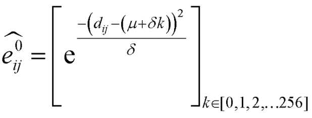
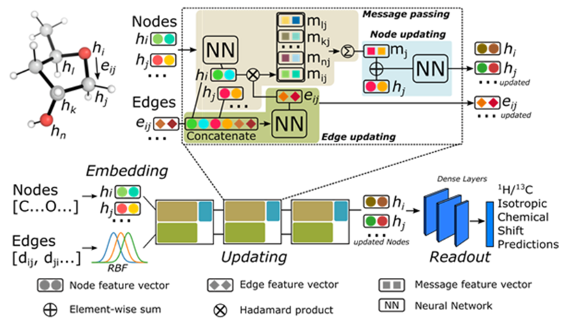
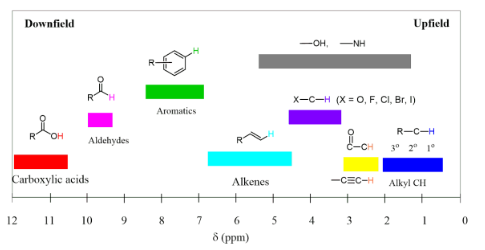

# Determining NMR Spectrum Peaks from Chemical Structure
### By
### Aidan McCrillis and Daniel Roche
## Introduction:
<t></t>The goal of this project is to accurately predict the structure of a chemical from its 1H NMR spectrum. This capability is essential in organic chemistry, where identifying the exact molecules produced by reactions is crucial. This identification process can be challenging, especially with large molecules that may contain numerous functional groups, making it a promising area for the application of machine learning and neural networks.  
  
In recent years, significant progress has been made in this area. Models such as CASCADE2 predict NMR peaks based on a given structure, while others, like ANN-PRA4 and the DP4/DP53 models, assess whether a proposed structure aligns with its NMR data. Our project's objective is to predict the NMR peaks that a specific chemical structure would produce under 1H NMR analysis.
## Problem:
Our dataset comprises 7,449 different chemical structures, the atomic coordinates for each structure and corresponding shift values that were associated with each particular proton. The goal of this project was to take a given chemical structure and predict its corresponding NMR peaks for protons in the molecule. This capability would support the confirmation of structural predictions by comparing predicted peaks with experimental spectra.
## Data:
Our dataset includes 7,449 different chemical structures with label NMR peak values for each hydrogen in all of the compounds. The preprocessing for this data includes reading from the SDF file into RDKit and using RDKit to extract all the features relevant for creating a graph structure. For this project this included the atom index, atom type, bond type, connectivity, bond distance. This information is what ended up being passed to our model to build predictions.

## Methods:
**Data Preprocessing:**
We preprocessed the NMR dataset by extracting features using RDKit, including atom types, bond types, distances, and connectivity. Connectivity was defined by considering atoms within 10 Angstroms of each other as connected, capturing both bonded and non-bonded interactions.

**Model Exploration: GCN and GIN**
We initially tested PyTorch’s built-in GCN and GIN models. GCN’s uniform aggregation method struggled with the complex relationships in our data, while GIN’s learnable aggregation function offered more expressiveness but lacked flexibility for the cascading relationships in the dataset.

**Custom GNN Model**
We developed a custom GNN based on the CASCADE model. Atom embeddings were created using a 256-dimensional vector, and edges were embedded via a radial basis function based on atom distances. The model included message-passing layers, where atom and bond states were updated iteratively, and hydrogen atom shifts were predicted after passing through hidden layers.

**Training**
The model was trained using the Adam optimizer with mean squared error loss. Hyperparameters such as batch size, learning rate, and the number of message-passing layers were tuned. Early stopping was applied after 10 epochs without improvement, and a cosine annealing learning rate scheduler was used.

**Evaluation**
The model’s performance was evaluated using a training-validation-test split, monitoring loss and accuracy to assess its generalization ability.

## Experiments and Analysis:
The first steps of this project consisted of looking for previous work on the topic of working machine learning nuclear magnetic spectroscopy and we saw that many previous studies had been done in this topic and that many of the previous studies had used graph neural networks as basis for their solution to these problems. Once we had taken a closer look at GNNs and understood the theory behind graph machine learning, we looked into how to preprocess this kind of data. To do this we looked at the code and scripts used in the CASCADE paper2 to see how this kind of data was preprocessed. This involved extracting information from the molecule in RDKit to get information about the atom type, bond type, distance between atoms, indexes and connectivity. Connectivity was defined by saying all atoms within 10 Angstroms of each other were connected in the graph. The motivation behind this is that atoms that exist close together will affect the chemical environment of each other whether they are bonded or not. This is also helpful because it allows for an easy definition of edges rather than having to search through the whole molecule to find explicit bonds.  

After our initial preprocessing, our first efforts involved using PyTorch’s built-in GCN and GIN models to address our problem. However, these models did not perform as expected, primarily because their standard configurations were not well-suited to capture the complex hierarchical and cascading relationships present in our dataset. Despite experimenting with various hyperparameters and adjustments, the models struggled to generalize effectively and meet our performance goals. Because of these issues, we decided to move towards developing a custom GNN architecture inspired by the CASCADE model. This approach allowed us to incorporate domain-specific insights, tailor the architecture to our dataset’s unique characteristics, and ultimately achieve more meaningful results.  

The GCN uses spectral graph convolutions to aggregate features from neighboring nodes.
It applies a shared weight to all nodes and their neighbors, followed by a non-linear activation. While efficient and scalable, GCN’s uniform aggregation often struggles to differentiate between complex node relationships, which limits its effectiveness on our dataset.  

GIN improves over GCN by leveraging a learnable aggregation function, enabling it to better distinguish graph structures. Its expressiveness allows it to theoretically achieve the power of the Weisfeiler-Lehman test for graph isomorphism. However, its fixed-layer approach lacked the flexibility needed to adapt to our data’s cascading relationships.  

The next step was to carefully inspect the code used in this paper so that we could apply the same type of transformations on the data that they did to the dataset. Once the data was preprocessed, we examined the code used to build the model used to work with the graph data. Next the model they built was implemented into PyTorch from the TensorFlow implementation that the paper used so that we could work with tuning hyperparameters and potentially working towards improving the model. The model that we built consisted of first embedding the different atom types into a 256 length vector that was different for each atom and learnable during training. Edges were embedded using a radial basis function that is defined below:

For this function, dij is defined as the distance between atoms. This is a more expressive way of working with the edges as being defined by their bond type because the distance between atoms is consistent between bonds of the same type (single bonds, double bonds, triple bonds, etc.). Once the edges and nodes of the graph were embedded, they were passed through a message layer.  

The message layer in the CASCADE model that we implemented works by first concatenating the atom embedding that is sending the message, the bond embedding and the atom embedding that is receiving the message. This is then passed through 4 hidden layers to get a final bond message. Next, the bond is updated by adding the message to the original bond state. To update the atom embedding with the message, the bond message is multiplied element-wise by the atom that is sending the message. Next, bonds that are sending messages to the same atom are added together to get the atom message. Then the atom messages are passed through 2 hidden layers to get the final atom messages. This is then added to the original atom state to get the updated atom.  

Finally, the hydrogen atoms are then extracted from the end of the message passing layers, and passed through four hidden layers to get a single mean centered shift value. The mean shift value for the dataset is then added to get the predicted shift values. A general overview of the CASCADE model message passing layer is shown below:

For this model, the mean squared error is used as the loss function, the Adam optimizer was used, early stopping after no improvement after 10 epochs was used, and a learning rate scheduler was implemented using the Cosine Annealing function.  

Once the model was implemented into PyTorch, we focused tuning different hyperparameters. For this we focused on the batch size, the amount of message passing layers, the learning rate. We also experimented with lowering the sizes of the training and validation sets to help lower computing time as runs with larger amounts of data proved to be computationally expensive. The different runs we ran are shown below in a table (Train/Validation Loss Graphs are shown at the bottom of the Report):  

## Results and Conclusions:
After our Hyperparameter tuning, we decided to use the model from experiment 11 as our final testing set. After being fitted, the model was tested using the held out testing set containing 500 molecules. Our final error values were 0.2167 ppm2 for our Mean Squared Error and 0.3041 ppm for our Mean Absolute Loss. This means that the average difference between the predicted shifts and the actual shifts were around 0.3. This is pretty good and would actually be usable as a way to test to see if a predicted molecule structure matches an experiment NMR spectroscopy result. To better put in context, a graph of typical hydrogen shift values are shown below:

