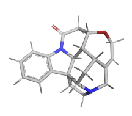

# Determining NMR Spectrum Peaks from Chemical Structure
### By
### Aidan McCrillis and Daniel Roche
## Introduction:
The goal of this project is to accurately predict the structure of a chemical from its 1H NMR spectrum. This capability is essential in organic chemistry, where identifying the exact molecules produced by reactions is crucial. This identification process can be challenging, especially with large molecules that may contain numerous functional groups, making it a promising area for the application of machine learning and neural networks. 
In recent years, significant progress has been made in this area. Models such as CASCADE2 predict NMR peaks based on a given structure, while others, like ANN-PRA4 and the DP4/DP53 models, assess whether a proposed structure aligns with its NMR data. Our project's objective is to predict the NMR peaks that a specific chemical structure would produce under 1H NMR analysis.
Problem:
Our dataset comprises 8,000 different chemical structures, the atomic coordinates for each structure and corresponding shift values that were associated with each particular proton. The goal of this project was to take a given chemical structure and predict its corresponding NMR peaks for protons in the molecule. This capability would support the confirmation of structural predictions by comparing predicted peaks with experimental spectra.
## Data:
Our dataset includes 8,000 different chemical structures with label NMR peak values for each hydrogen in all of the compounds. The preprocessing for this data includes reading from the SDF file into RDKit and using RDKit to extract all the features relevant for creating a graph structure. For this project this included the atom index, atom type, bond type, connectivity, bond distance. This information is what ended up being passed to our model to build predictions.

## Experiments and Analysis:
The first steps of this project consisted of looking for previous work on the topic of working machine learning nuclear magnetic spectroscopy and we saw that many previous studies had been done in this topic and that many of the previous studies had used graph neural networks as basis for their solution to these problems. Once we had taken a closer look at GNNs and understood the theory behind graph machine learning, we looked into how to preprocess this kind of data. To do this we looked at the code and scripts used in the CASCADE paper2 to see how this kind of data was preprocessed. The next step was to carefully inspect the code used in this paper so that we could apply the same type of transformations on the data that they did to the dataset. 

## Things I think we should talk about here:
Literature review
- Failed model attempts:
	Our initial efforts involved using PyTorch’s built-in GCN and GIN models to address our problem. However, these models did not perform as expected, primarily because their standard configurations were not well-suited to capture the complex hierarchical and cascading relationships present in our dataset. Despite experimenting with various hyperparameters and adjustments, the models struggled to generalize effectively and meet our performance goals. Recognizing these limitations, our team decided to pivot towards developing a custom GNN architecture inspired by the CASCADE model. This approach allowed us to incorporate domain-specific insights, tailor the architecture to our dataset’s unique characteristics, and ultimately achieve more meaningful results.
- Code analysis of the paper we were looking at
- Preprocessing in detail
- Construction of sequence object and understanding how batches work when working with customly designed graphs
- Implementation of the CASCADE model into PyTorch from Tensorflow / Keras
- Working to improve the model through Hyperparameter Searching and what exactly we tested

## Future Directions:
- Looking into different types of GNN layers and experimenting more with the current model
- Looking into GCNs and Graph Transformers
